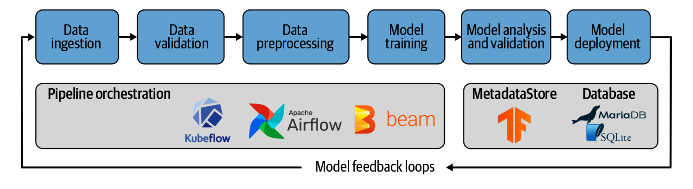

# MLE Project

## Goal
Building a ML Pipeline in order to automate model lifecycle steps. We are faced with a Business Question and aim to solve it use it Machine Learning. However, we'd also like to build a system that automates the steps of modelling in order to promote ease of development, experimentation, and deployment. 

## Model Pipeline
An example of our ML Pipeline is shown below:

## ML Pipeline Architecture
The architecture we will use for each step of the pipline is shown below. The structure and the basic setup of the machine learning pipeline can be transferred and reused for different MLE use cases. 

## Business Question
Given data about a complaint, we would like to predict whether the complaint was disputed by the consumer. In order to accomplish this, we frame this as a Binary Classification problem. Factors include: zip code, US state, text of the complaint, financial product, etc...

## Sources

*Hapke, Hannes, and Catherine Nelson. Building Machine Learning Pipelines: Automating Model Life Cycles with Tensorflow. O'Reilly, 2020.*
